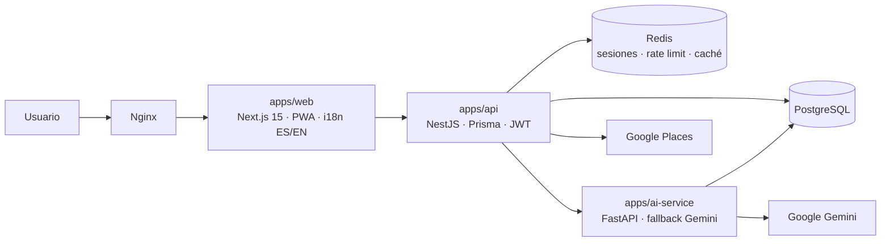

<p align="center">
  
</p>

# Brindi

**Brindi** es una web app (PWA) gratuita pensada para grupos de amigos y familia que quedan en persona. Resuelve tres fricciones sociales mediante tres módulos con identidad propia:

- **DIVIDE** — Calculadora de división de cuentas (foto del ticket con OCR por IA o entrada manual, varios modos de reparto, resultado compartible).
- **DECIDE** — Juegos de decisión y entretenimiento grupal (ruleta, cartas, toque simultáneo, quizzes con IA).
- **PLAN** — Generador de planes con IA según ubicación, presupuesto, tiempo y tipo de plan.

> Documentación en español durante el desarrollo; la versión final del README será bilingüe (ES/EN).

## Principio de privacidad (no negociable)

La aplicación **no almacena de forma persistente ningún dato sensible, financiero o personal** más allá de lo estrictamente necesario para el login (usuario, email, contraseña hasheada):

- DIVIDE no guarda tickets, importes ni datos de pago de terceros en base de datos: todo el cálculo ocurre en memoria del cliente y se descarta. Solo el propio usuario puede guardar, opcionalmente, **su** enlace de pago en su perfil.
- La ubicación se usa solo en el momento de la petición a PLAN y nunca se persiste asociada a un usuario.
- Los resultados de DECIDE no se persisten en servidor (como mucho, historial local efímero en el dispositivo).

## Arquitectura objetivo



## Estado del proyecto

Desarrollo incremental; cada incremento es funcional y verificable.

| # | Incremento | Estado |
|---|------------|--------|
| 1 | Scaffold del monorepo + infra local (PostgreSQL + Redis) + setup | ✅ |
| 2 | API NestJS + Prisma (schema, migraciones, seed) + Swagger | ✅ |
| 3 | Autenticación email+password (JWT + refresh, rate limiting) | ✅ |
| 4 | Frontend Next.js 15 + Tailwind 4 + i18n + PWA + branding | ✅ |
| 5 | Registro/login/perfil conectados (enlace de pago opcional) | ✅ |
| 6 | DIVIDE: wizard completo con cálculo en cliente | ✅ |
| 7 | ai-service (FastAPI) + cascada Gemini + OCR de tickets | ⏳ |
| 8 | DECIDE: ruleta, cartas, toque simultáneo | ⏳ |
| 9 | DECIDE: quiz de grupo + trivia con IA + modo offline | ⏳ |
| 10 | PLAN: geolocalización + Places (caché Redis) + plan IA | ⏳ |
| 11 | OAuth con Google | ⏳ |
| 12 | Nginx + compose de producción + SECURITY.md (OWASP) | ⏳ |
| 13 | Tests unitarios + verify.sh | ⏳ |
| 14 | E2E (Playwright), accesibilidad (axe, Lighthouse), monkey, carga | ⏳ |
| 15 | CI (GitHub Actions) + Dependabot + docs finales | ⏳ |

## Requisitos

- Docker + Docker Compose v2 (único requisito obligatorio).
- Bash (Linux, macOS o WSL en Windows).

## Instalación local

```bash
./scripts/setup-local.sh
```

El script verifica prerequisitos, crea `.env` a partir de `.env.example` generando secretos aleatorios, levanta los servicios con Docker Compose y espera a que estén *healthy*. Las claves de Google (Gemini, OAuth, Places) deben rellenarse a mano en `.env` cuando se activen los módulos de IA y mapas (el propio `.env.example` documenta dónde obtenerlas).

Para parar todo:

```bash
docker compose --env-file .env -f infra/docker-compose.yml down
```

## API (apps/api)

La API arranca dentro de Docker con `setup-local.sh`; en cada arranque el contenedor aplica las migraciones de Prisma pendientes y ejecuta el seed (ambos idempotentes). Endpoints actuales (detalle completo en Swagger, `http://localhost:4000/api/docs`):

| Método | Ruta | Descripción |
|--------|------|-------------|
| GET | `/health` | Estado de API y base de datos |
| POST | `/auth/register` | Registro email+password (bcrypt 12 rondas) — 10 req/min |
| POST | `/auth/login` | Login; devuelve access token y rota la cookie de refresco — 10 req/min |
| POST | `/auth/refresh` | Renueva el access token desde la cookie httpOnly (rotación) |
| POST | `/auth/logout` | Elimina la cookie de refresco |
| GET | `/users/me` | Perfil del usuario autenticado (Bearer) |
| PATCH | `/users/me` | Actualiza nombre, idioma o enlace de pago propio |
| DELETE | `/users/me` | Baja lógica de la cuenta (`deleted_at`) |

El access token (15 min) viaja como `Authorization: Bearer`; el refresh token (7 días) vive en una cookie `httpOnly` con `SameSite=Strict` y `path=/auth`, y se rota en cada refresco.

Para desarrollo directo con hot reload (sin reconstruir el contenedor):

```bash
cd apps/api
npm install
npm run start:dev   # lee DATABASE_URL del .env de la raíz (generada por setup-local.sh)
```

Comandos útiles desde `apps/api`: `npm run prisma:migrate:dev` (nueva migración), `npm run prisma:seed` (recargar preguntas de fallback).

## Frontend (apps/web)

Next.js 15 (App Router) + TypeScript + Tailwind CSS 4, con Framer Motion para animaciones y Lucide para iconografía (nunca emojis en la UI). Disponible en `http://localhost:3000` tras el `setup-local.sh`.

- **Idiomas**: español en `/` (por defecto) e inglés en `/en`, con next-intl. El idioma se detecta del navegador en la primera visita y el selector manual persiste la elección en la cookie `NEXT_LOCALE`.
- **Tema claro/oscuro**: conmutable y siguiendo el sistema por defecto, con tokens de color auditables para contraste.
- **PWA**: manifest con iconos (incluye maskable) y service worker propio con caché de estáticos y página offline. El modo offline completo de los quizzes de DECIDE llega en su incremento.
- **Navegación**: header con navegación en escritorio y barra de pestañas inferior estilo app en móvil (mobile-first).
- **Divide** (módulo completo): wizard de 4 pasos (personas → cuenta → reparto → resultado) con entrada manual de ítems y los cuatro modos de reparto (partes iguales, por ítems, porcentajes que suman 100 % y extra fijo). Todo el cálculo ocurre en el dispositivo y **no se persiste nada**; el resultado se comparte con la Web Share API (o se copia al portapapeles). Si has iniciado sesión y tienes enlace de pago, se incluye en el mensaje.
- **Decide** y **Plan** son por ahora páginas de avance navegables; se implementan en sus incrementos.
- **Cuenta de usuario**: registro, inicio de sesión y página de cuenta (`/login`, `/register`, `/account`) conectados a la API. El perfil permite editar el nombre y un enlace de pago propio opcional (solo `https://`), y dar de baja la cuenta. La cabecera muestra **Entrar** o **Mi cuenta** según el estado de sesión.

Para desarrollo con hot reload:

```bash
cd apps/web
npm install
npm run dev   # http://localhost:3000
```

## Estructura del repositorio

```
brindi/
├── apps/
│   ├── api/               # Backend NestJS + Prisma (health, Swagger, migraciones, seed)
│   └── web/               # Frontend Next.js 15 (PWA, i18n ES/EN, Tailwind 4)
├── packages/              # (próximos incrementos) shared-types
├── assets/branding/       # logo e icono oficiales
├── infra/                 # docker-compose.yml (+ nginx y prod más adelante)
├── scripts/               # setup-local.sh (+ verify.sh y auditorías más adelante)
├── tests/                 # (próximos incrementos) e2e, load, monkey
├── .env.example
├── LICENSE
└── README.md
```

## Decisiones de diseño

- **Nombre "Brindi" verificado**: no se encontró ninguna app o marca activa idéntica en el mismo sector. Los nombres más cercanos existentes ("Brindis/BrindisApp" — suscripción de consumiciones en bares en España; "Brindisa" — pedidos de un distribuidor de alimentación; "BrindApp" — pedidos, Italia) son distintos en nombre y función. El branding está centralizado en la variable `APP_NAME` de `.env` y los identificadores técnicos usan el literal `brindi`, renombrable con un find & replace.
- **Redis sin persistencia en disco** (`--save "" --appendonly no`): solo aloja datos efímeros (sesiones, rate limiting, caché de Places), coherente con el principio de privacidad.
- **Secretos autogenerados**: `setup-local.sh` genera `JWT_SECRET` y `POSTGRES_PASSWORD` aleatorios en la primera ejecución; nunca hay secretos reales en el repositorio.
- **PostgreSQL 16 / Redis 7 en imágenes Alpine**: ligeras y suficientes para desarrollo; misma versión mayor que se usará en producción.
- **Prisma sin motores binarios** (`engineType = "client"` + driver adapter `@prisma/adapter-pg`): el cliente usa el query compiler WASM incluido en el propio paquete npm, eliminando la descarga de binarios Rust. Builds de Docker más rápidos y menos puntos de fallo; las migraciones siguen usando la CLI estándar de Prisma (`migrate deploy` en el arranque del contenedor).
- **Enums nativos de PostgreSQL** (`QuizCategory`, `QuizLevel`, `AiService`) para integridad de datos en lugar de strings libres.
- **Columna `locale` en `quiz_fallback_questions`** (default `es`): el mínimo de 10 preguntas por categoría se cumple en español; permitirá añadir el set en inglés sin tocar el esquema.
- **`password_hash` opcional en `users`**: los usuarios que entren solo con Google OAuth no tienen contraseña local.
- **`@@unique([category, question])`**: habilita un seed idempotente (`createMany` + `skipDuplicates`) que se ejecuta en cada arranque del contenedor sin duplicar filas.
- **Migración inicial versionada y revisada a mano** con el formato exacto del generador de Prisma, aplicada y verificada contra PostgreSQL 16.
- **bcryptjs (12 rondas)** en lugar del `bcrypt` nativo: mismo algoritmo, implementación JS pura que evita la toolchain de compilación nativa en imágenes Alpine (builds reproducibles y más simples).
- **Refresh token stateless con rotación**: JWT de refresco (7 días) en cookie `httpOnly` + `SameSite=Strict` + `path=/auth`, firmado con un secreto distinto al del access token (15 min). Sin tabla de tokens (esquema minimalista): el logout elimina la cookie y la baja lógica invalida cualquier token al instante porque la estrategia JWT consulta `deleted_at` en cada petición. Trade-off documentado: no hay lista de revocación server-side.
- **Rate limiting con `@nestjs/throttler`**: 10 req/min en login/registro (equivalente a `throttle:10,1`), límite global laxo de 100 req/min. Almacenamiento en memoria por ahora; pasará a Redis cuando haya varias instancias.
- **Anti-enumeración en login**: mensaje idéntico (`Credenciales inválidas`) tanto si el email no existe como si la contraseña falla o la cuenta está dada de baja.
- **Baja lógica (`deleted_at`)**: el email no es reutilizable tras la baja (índice único); una futura reactivación se haría por soporte/proceso explícito.
- **i18n con prefijo "as-needed"**: el español (mercado principal) vive en la raíz `/` y el inglés en `/en`; la selección manual persiste vía cookie `NEXT_LOCALE` gestionada por el middleware de next-intl.
- **Tipografía de sistema** (display redondeado `ui-rounded` con fallbacks): cero descargas de fuentes externas, builds reproducibles incluso sin red; sustituible por `next/font` si algún día se quiere una fuente propia.
- **Tokens de marca en Tailwind 4 (`@theme`)** derivados del logo: un color por módulo (Divide verde, Decide ámbar, Plan azul) sobre tinta verdosa y papel crema, con variantes claro/oscuro semánticas (`background`, `surface`, `muted`, `line`).
- **Service worker propio y versionado a mano** (sin librerías): cache-first para estáticos inmutables, network-first con página offline para navegaciones. Pequeño, auditable y suficiente para la PWA.
- **Accesibilidad desde la base**: skip-link, foco visible global, `aria-current` en navegación, iconos decorativos con `aria-hidden` y `prefers-reduced-motion` respetado por CSS y por Framer Motion (`MotionConfig reducedMotion="user"`).
- **Access token solo en memoria**: el token de acceso se guarda en el estado de la app (Zustand), nunca en `localStorage` ni `sessionStorage` (no es legible por XSS). Al cargar la app se rehidrata la sesión llamando a `/auth/refresh`, que usa la cookie `httpOnly`; así la sesión persiste entre recargas (los 7 días del refresh token) sin exponer credenciales.
- **Refresco transparente ante 401**: el cliente de API reintenta una vez tras refrescar el token, con _single-flight_ (varias peticiones que caduquen a la vez comparten un único refresco). Si el refresco falla, se limpia la sesión y se redirige a `/login`.
- **Mensajes de error localizados por código de estado**: la validación de formularios ocurre en cliente y los errores del servidor (409 email duplicado, 401 credenciales) se traducen en el frontend según el código HTTP, en lugar de mostrar el texto en español de la API a usuarios en inglés.
- **Color sin ser el único canal**: los estados de éxito/error combinan color con icono y texto; se añadió un token de "peligro" que se adapta a claro/oscuro para cumplir contraste AA en ambos temas, y los botones primarios usan el teal profundo para garantizar 4.5:1 sobre texto blanco.

### Módulo Divide
- **Cálculo 100 % en cliente y sin persistencia**: el estado del wizard vive solo en memoria (un `useReducer` con contexto); no se usa `localStorage` ni se envía nada a la API. Recargar la página reinicia el reparto, que es justo el comportamiento correcto por privacidad.
- **Dinero en céntimos (enteros)**: los importes se parsean a céntimos para evitar errores de coma flotante. El parser es tolerante con separadores (`12,50` y `12.50`, con miles), y el formato de salida usa `Intl.NumberFormat` por idioma.
- **Reparto justo con método del mayor resto**: una única función (`allocateProportional`) reparte cualquier total por pesos garantizando que la suma de las partes es exactamente el total; los céntimos sobrantes van a quienes tienen mayor parte fraccionaria. Los cuatro modos se reducen a esa función. Lógica pura y testeable (validada con 27 casos de cálculo y 17 del reducer).
- **Moneda EUR por ahora**: el mercado principal es España; una moneda configurable es una mejora futura sin impacto en el motor de cálculo.
- **Compartir con Web Share API y respaldo a portapapeles**: en móvil abre la hoja de compartir nativa; en escritorio sin soporte, copia el mensaje y avisa.

## Licencia

[MIT](LICENSE)
