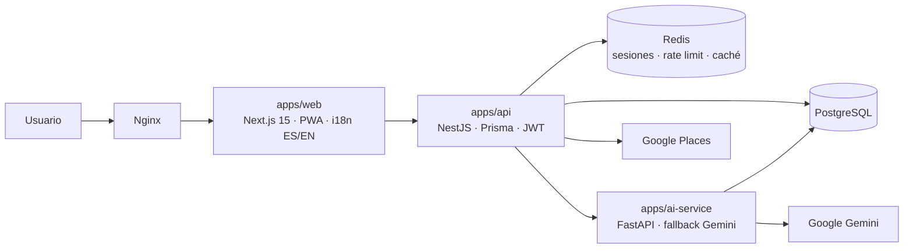

<p align="center">
  
</p>

# Brindi

**Brindi** es una web app (PWA) gratuita pensada para grupos de amigos y familia que quedan en persona. Resuelve tres fricciones sociales mediante tres módulos con identidad propia:

- **DIVIDE** — Calculadora de división de cuentas (foto del ticket con OCR por IA o entrada manual, varios modos de reparto, resultado compartible).
- **DECIDE** — Juegos de decisión y entretenimiento grupal (ruleta, cartas, toque simultáneo, quizzes con IA).
- **PLAN** — Generador de planes con IA según ubicación, presupuesto, tiempo y tipo de plan.

> Documentación en español durante el desarrollo; la versión final del README será bilingüe (ES/EN).

## Principio de privacidad (no negociable)

La aplicación **no almacena de forma persistente ningún dato sensible, financiero o personal** más allá de lo estrictamente necesario para el login (usuario, email, contraseña hasheada):

- DIVIDE no guarda tickets, importes ni datos de pago de terceros en base de datos: todo el cálculo ocurre en memoria del cliente y se descarta. Solo el propio usuario puede guardar, opcionalmente, **su** enlace de pago en su perfil.
- La ubicación se usa solo en el momento de la petición a PLAN y nunca se persiste asociada a un usuario.
- Los resultados de DECIDE no se persisten en servidor (como mucho, historial local efímero en el dispositivo).

## Arquitectura objetivo



## Estado del proyecto

Desarrollo incremental; cada incremento es funcional y verificable.

| # | Incremento | Estado |
|---|------------|--------|
| 1 | Scaffold del monorepo + infra local (PostgreSQL + Redis) + setup | ✅ |
| 2 | API NestJS + Prisma (schema, migraciones, seed) + Swagger | ✅ |
| 3 | Autenticación email+password (JWT + refresh, rate limiting) | ⏳ |
| 4 | Frontend Next.js 15 + Tailwind 4 + i18n + PWA + branding | ⏳ |
| 5 | Registro/login/perfil conectados (enlace de pago opcional) | ⏳ |
| 6 | DIVIDE: wizard completo con cálculo en cliente | ⏳ |
| 7 | ai-service (FastAPI) + cascada Gemini + OCR de tickets | ⏳ |
| 8 | DECIDE: ruleta, cartas, toque simultáneo | ⏳ |
| 9 | DECIDE: quiz de grupo + trivia con IA + modo offline | ⏳ |
| 10 | PLAN: geolocalización + Places (caché Redis) + plan IA | ⏳ |
| 11 | OAuth con Google | ⏳ |
| 12 | Nginx + compose de producción + SECURITY.md (OWASP) | ⏳ |
| 13 | Tests unitarios + verify.sh | ⏳ |
| 14 | E2E (Playwright), accesibilidad (axe, Lighthouse), monkey, carga | ⏳ |
| 15 | CI (GitHub Actions) + Dependabot + docs finales | ⏳ |

## Requisitos

- Docker + Docker Compose v2 (único requisito obligatorio).
- Bash (Linux, macOS o WSL en Windows).

## Instalación local

```bash
./scripts/setup-local.sh
```

El script verifica prerequisitos, crea `.env` a partir de `.env.example` generando secretos aleatorios, levanta los servicios con Docker Compose y espera a que estén *healthy*. Las claves de Google (Gemini, OAuth, Places) deben rellenarse a mano en `.env` cuando se activen los módulos de IA y mapas (el propio `.env.example` documenta dónde obtenerlas).

Para parar todo:

```bash
docker compose --env-file .env -f infra/docker-compose.yml down
```

## API (apps/api)

La API arranca dentro de Docker con `setup-local.sh`; en cada arranque el contenedor aplica las migraciones de Prisma pendientes y ejecuta el seed (ambos idempotentes). Endpoints disponibles en este incremento: `GET /health` (estado de API y base de datos) y la documentación OpenAPI en `http://localhost:4000/api/docs`.

Para desarrollo directo con hot reload (sin reconstruir el contenedor):

```bash
cd apps/api
npm install
npm run start:dev   # lee DATABASE_URL del .env de la raíz (generada por setup-local.sh)
```

Comandos útiles desde `apps/api`: `npm run prisma:migrate:dev` (nueva migración), `npm run prisma:seed` (recargar preguntas de fallback).

## Estructura del repositorio

```
brindi/
├── apps/
│   └── api/               # Backend NestJS + Prisma (health, Swagger, migraciones, seed)
├── packages/              # (próximos incrementos) shared-types
├── assets/branding/       # logo e icono oficiales
├── infra/                 # docker-compose.yml (+ nginx y prod más adelante)
├── scripts/               # setup-local.sh (+ verify.sh y auditorías más adelante)
├── tests/                 # (próximos incrementos) e2e, load, monkey
├── .env.example
├── LICENSE
└── README.md
```

## Decisiones de diseño

- **Nombre "Brindi" verificado**: no se encontró ninguna app o marca activa idéntica en el mismo sector. Los nombres más cercanos existentes ("Brindis/BrindisApp" — suscripción de consumiciones en bares en España; "Brindisa" — pedidos de un distribuidor de alimentación; "BrindApp" — pedidos, Italia) son distintos en nombre y función. El branding está centralizado en la variable `APP_NAME` de `.env` y los identificadores técnicos usan el literal `brindi`, renombrable con un find & replace.
- **Redis sin persistencia en disco** (`--save "" --appendonly no`): solo aloja datos efímeros (sesiones, rate limiting, caché de Places), coherente con el principio de privacidad.
- **Secretos autogenerados**: `setup-local.sh` genera `JWT_SECRET` y `POSTGRES_PASSWORD` aleatorios en la primera ejecución; nunca hay secretos reales en el repositorio.
- **PostgreSQL 16 / Redis 7 en imágenes Alpine**: ligeras y suficientes para desarrollo; misma versión mayor que se usará en producción.
- **Prisma sin motores binarios** (`engineType = "client"` + driver adapter `@prisma/adapter-pg`): el cliente usa el query compiler WASM incluido en el propio paquete npm, eliminando la descarga de binarios Rust. Builds de Docker más rápidos y menos puntos de fallo; las migraciones siguen usando la CLI estándar de Prisma (`migrate deploy` en el arranque del contenedor).
- **Enums nativos de PostgreSQL** (`QuizCategory`, `QuizLevel`, `AiService`) para integridad de datos en lugar de strings libres.
- **Columna `locale` en `quiz_fallback_questions`** (default `es`): el mínimo de 10 preguntas por categoría se cumple en español; permitirá añadir el set en inglés sin tocar el esquema.
- **`password_hash` opcional en `users`**: los usuarios que entren solo con Google OAuth no tienen contraseña local.
- **`@@unique([category, question])`**: habilita un seed idempotente (`createMany` + `skipDuplicates`) que se ejecuta en cada arranque del contenedor sin duplicar filas.
- **Migración inicial versionada y revisada a mano** con el formato exacto del generador de Prisma, aplicada y verificada contra PostgreSQL 16.

## Licencia

[MIT](LICENSE)
